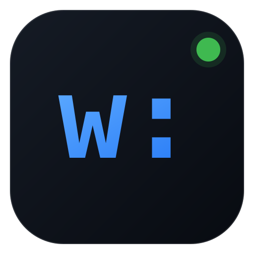
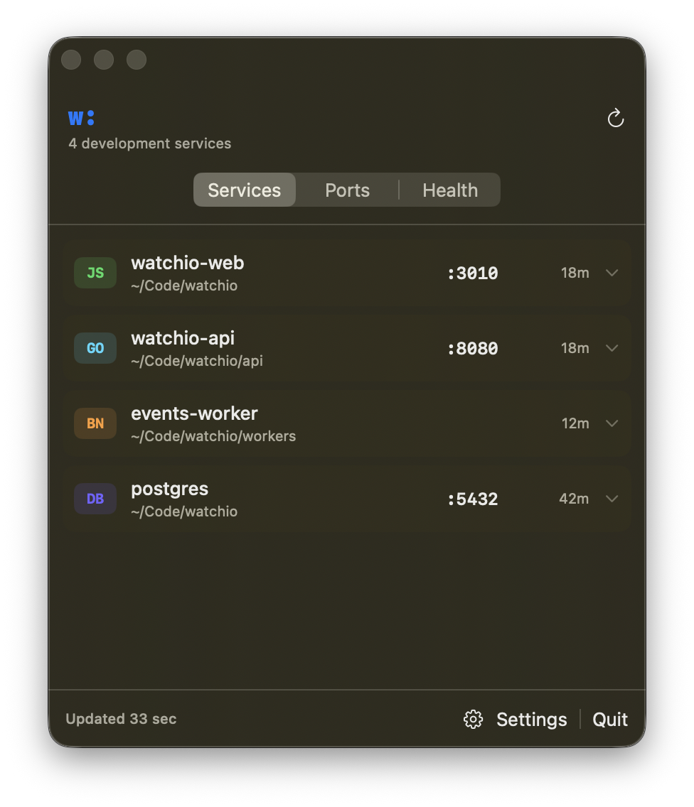
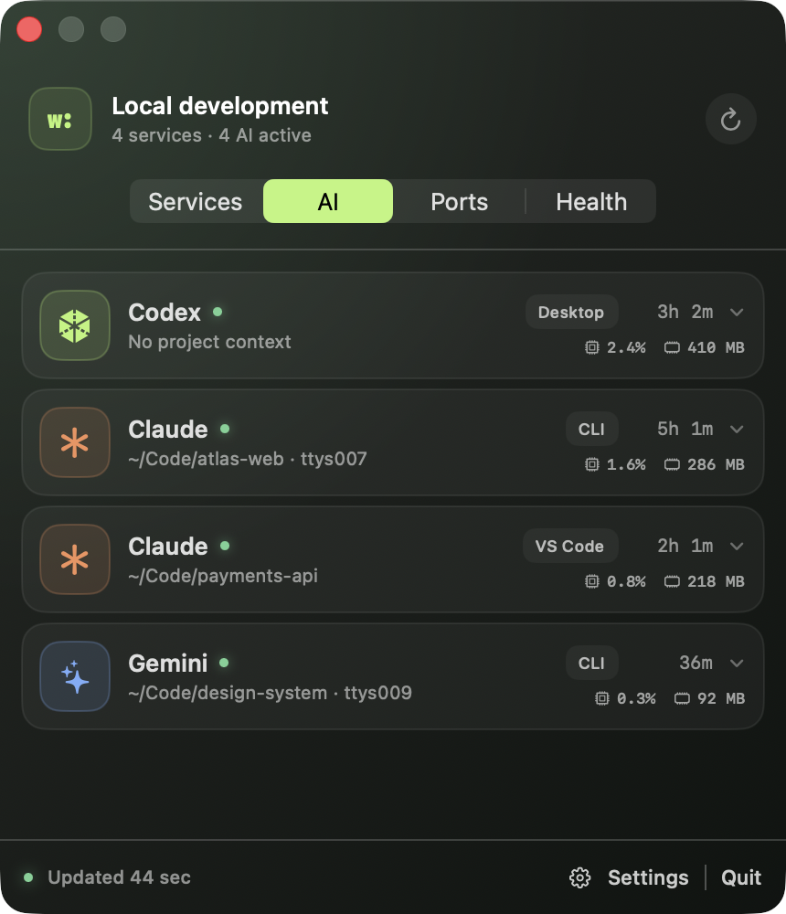
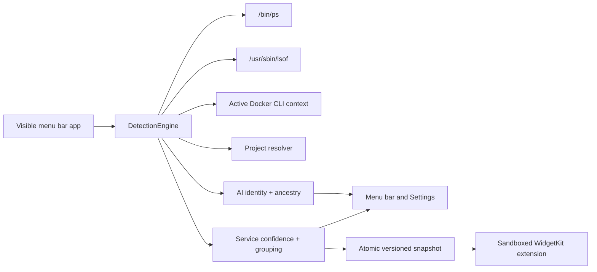

<p align="center">
  
</p>

<h1 align="center">Watchio</h1>

<p align="center">A private, native macOS view of the development services and AI tools already running on your machine.</p>

<p align="center">
  <a href="https://github.com/mi-aleks/watchio/actions/workflows/ci.yml"></a>
  
  
  <a href="LICENSE"></a>
</p>



Watchio answers the small but persistent question: **what did I leave running?** It detects supported development runtimes and local AI tools, their project, process tree, resource use, and listening ports—then makes the result glanceable from the menu bar and Widget Center.

Watchio `0.1.0-alpha.1` is source-only. It is not signed, notarized, distributed as a DMG, or available through Homebrew yet.

## Why Watchio

- Native SwiftUI menu bar app and Small, Medium, and Large widgets
- Original runtime glyphs make Node.js, Go, Python, Bun, Deno, containers, and common Compose
  databases recognizable at a glance
- A dedicated AI activity view recognizes supported CLI, IDE, desktop, and child-agent processes
- Automatic, explainable detection instead of a manually maintained service list
- First-class Node.js, Bun, Deno, Go, Python, and Docker Compose support
- Observe-only: Watchio cannot stop, restart, or otherwise change a process
- Fully local: no telemetry, accounts, network requests, root access, or stored history
- Deliberately conservative: uncertain candidates go to Review instead of appearing silently

## Build from source in five minutes

You need an Apple Silicon Mac running macOS 14.5 or later and Xcode 16.2 or later.

```bash
git clone https://github.com/mi-aleks/watchio.git
cd watchio
open Watchio.xcodeproj
```

In Xcode:

1. Select the **WatchioApp** target, then Signing & Capabilities.
2. Select your local Apple development team. Do the same for **WatchioWidget**.
3. Select the **Watchio** scheme and choose **My Mac**.
4. Press <kbd>⌘R</kbd>. Look for `w:` in the menu bar.

The App Group is team-prefixed, so source builders do not need the maintainer's registered App Group. A clean unsigned command-line build is also supported:

```bash
make check
```

## What Watchio detects

| Runtime | Typical evidence | Notes |
|---|---|---|
| Node.js | `node`, project marker, listener, terminal ancestry | Includes child processes in the logical service |
| Bun | `bun` / `bunx`, project marker or terminal ancestry | Workers do not need a port |
| Deno | `deno`, project marker or listener | Observe-only |
| Go | `go` or a `go-build` executable, project marker/listener | Compiled binaries without Go metadata need strong project evidence |
| Python | `python*`, project marker or terminal ancestry | Virtualenv and toolchain paths add evidence |
| Docker Compose | Compose labels from the active local Docker CLI context | Remote contexts and raw Docker backend processes are suppressed |

Every ten seconds the visible menu bar app invokes fixed executable paths and argument arrays for `ps` and `lsof`, plus the Docker CLI when available. It only considers processes owned by the current UID and ignores processes younger than three seconds.

The confidence model is intentionally simple and documented:

| Evidence | Score |
|---|---:|
| Working directory resolves to a project marker | +40 |
| Supported runtime | +25 |
| Listening TCP/UDP endpoint | +20 |
| Terminal or IDE ancestry | +15 |
| Development toolchain path | +10 |

Scores of 60 or more appear automatically. Scores from 40–59 go to **Settings → Review**. Lower scores stay hidden. GUI executables, system daemons, Watchio itself, Docker's backend, and unexplained launchd children receive strong penalties. See [Detection](docs/detection.md) for the complete contract.

## Local AI activity



The AI view reuses the same `ps` inventory and recognizes exact executable identities for Codex,
Claude, Gemini CLI, Aider, OpenCode, Goose, GitHub Copilot CLI, and Cursor Agent. It labels where
an activity is hosted—CLI, VS Code, desktop, background, or a child agent—and groups ordinary
descendant processes under the nearest recognized AI process. Every AI row shows the current CPU
percentage and resident RAM for that complete logical process tree; the expanded detail exposes
the representative PID and included process count.

AI detection has a separate, conservative score:

| Evidence | Score |
|---|---:|
| Exact supported executable | +45 |
| Recognized installation path | +20 |
| Working directory resolves to a project | +15 |
| Terminal, IDE, or desktop host | +15 |
| Recognized AI-process ancestry | +10 |

Activities need a score of 60 to appear. Detection is process-only: Watchio never reads prompts,
conversation files, session history, task titles, raw arguments, or environment variables. A
desktop app that multiplexes several logical agents inside one OS process appears as one activity;
separate agent processes can appear independently. Script-based tools that expose only a generic
`node` or `python` executable cannot be identified safely and remain hidden.

## Widgets are snapshots, not monitors

WidgetKit controls refresh timing. Watchio writes one versioned snapshot atomically and asks WidgetKit to reload for material service/resource changes or a throttled freshness heartbeat. A widget shows freshness and moves to an offline state when its snapshot becomes stale. Keep the menu bar app running for collection; Watchio does not install a hidden LaunchAgent.

Widget configuration supports Services, AI Activity, Ports, or Health, across all projects or a named project. Widget taps deep-link to `watchio://`.

## Privacy and security

Watchio is designed so useful output does not require sensitive input:

- Process inventory is restricted to the current Unix UID.
- Environment variables are never read into inventory, snapshots, or diagnostics.
- Raw command arguments are never stored and never enter snapshots.
- AI prompts, conversation files, session history, and task titles are never read.
- Home paths are shortened to `~`; external paths are reduced to a display name.
- Only the latest snapshot is retained. Resource trends remain bounded in memory.
- There are no application network APIs, accounts, analytics, or update checks.
- Docker collection refuses non-local CLI contexts, so discovery cannot contact a remote engine.
- Subprocesses use fixed executable URLs, explicit arguments, timeouts, cancellation, and output limits—never shell interpolation.
- The collector app is nonsandboxed because macOS process inspection requires it; the widget is sandboxed. Release builds enable Hardened Runtime.

Read [PRIVACY.md](PRIVACY.md), [SECURITY.md](SECURITY.md), and the [threat-conscious architecture](docs/architecture.md) before extending collection.

## Architecture



The dependency-free local Swift package separates `WatchioModels`, `WatchioDetection`, and `WatchioStorage`. Protocol boundaries make every external inventory source fixture-testable. See [Architecture](docs/architecture.md) and [ADR-0001](docs/adr/0001-native-observe-only.md).

## Development

```bash
make format       # apply Apple swift-format
make format-check # strict formatting lint
make test         # package unit tests
make ui-test      # deterministic native UI tests (local interactive session)
make build        # unsigned Debug app + widget
make check        # all required local checks
```

Set `WATCHIO_RUN_INTEGRATION_TESTS=1` when running `swift test` to enable the real temporary-listener `ps`/`lsof` integration test. CI validates Xcode 16.2, Xcode 26.2, deterministic native UI flows, unsigned arm64 Release, coverage instrumentation, privacy invariants, formatting, and local documentation links.

## Known limitations

- Apple Silicon only; Intel is not a release target.
- Automatic detection is heuristic. Review the confidence evidence when a service is missing or surprising.
- macOS may delay WidgetKit refreshes. The menu bar view is the freshest source.
- `lsof` and Docker can be unavailable or degraded; Watchio reports source health instead of failing the whole scan.
- Service names are inferred without storing command arguments, so two identical runtimes in one process group may be grouped together.
- AI activity is process-level, not conversation-level; internal desktop sessions are intentionally opaque.
- AI tools implemented as generic `node` or `python` processes may be hidden rather than guessed from arguments.
- The alpha is source-only and uses your local development team. There is no automatic updater.

## Roadmap

- `0.1`: conservative local detection, menu bar, configurable widgets, source distribution
- `0.2`: curated rule presets, richer project naming, expanded accessibility/UI automation
- `0.3`: signed and notarized builds, after reproducible release automation and security review

The detailed roadmap lives in [docs/roadmap.md](docs/roadmap.md). DMG and Homebrew distribution intentionally wait for Developer ID signing and notarization.

## Contributing and support

Contributions are welcome. Start with [CONTRIBUTING.md](CONTRIBUTING.md), follow the [Code of Conduct](CODE_OF_CONDUCT.md), and read [SUPPORT.md](SUPPORT.md) before opening a question. Security reports belong in GitHub's private vulnerability reporting flow, not a public issue.

Watchio is available under the [MIT License](LICENSE). The `w:` identity and repository assets are original and MIT-licensed with the project.
