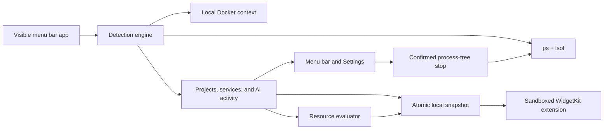

<p align="center">
  
</p>

<h1 align="center">Watchio</h1>

<p align="center"><strong>Your local development runtime, at a glance.</strong></p>

<p align="center">
  See services, ports, AI agents, CPU, and memory from the macOS menu bar.<br>
  Stop a verified process tree when it should no longer be running.
</p>

<p align="center">
  <a href="https://github.com/mi-aleks/watchio/actions/workflows/ci.yml"></a>
  
  
  
  <a href="LICENSE"></a>
</p>


## Install with your coding agent

Paste this into Codex, Claude Code, Cursor, or another coding agent with terminal access:

```text
Install Watchio on this Mac from https://github.com/mi-aleks/watchio.

Use the repository's supported local install flow. Confirm this is an Apple Silicon Mac running
macOS 14 or newer with Xcode 16.2 or newer. Clone or update the repository without overwriting any
local work, run `make check`, then run `make install`. Do not use sudo, disable Gatekeeper, or change
macOS security settings. Verify that `~/Applications/Watchio.app` exists and Watchio is running,
then tell me how to add its widget. If a step fails, diagnose it and stop instead of bypassing a
security control.
```

That is the recommended install path today. The agent uses Watchio's checked-in installer rather
than inventing build commands: it creates a Release build on your Mac, signs it to run locally,
validates the embedded widget, installs it to `~/Applications`, and opens it.

## Or install from Terminal

```bash
mkdir -p ~/Code
git clone https://github.com/mi-aleks/watchio.git ~/Code/watchio
cd ~/Code/watchio
make install
```

No `sudo`, package manager, Apple account, or security workaround is required. To update later:

```bash
cd ~/Code/watchio
git pull --ff-only
make install
```

The installer is intentionally transparent. Read [`Scripts/install-local.sh`](Scripts/install-local.sh)
or see the [build guide](docs/building.md) for custom install locations, unattended installs, and
optional Apple Development team signing.

> **Requirements:** Apple Silicon, macOS 14+, and Xcode 16.2+ selected with `xcode-select`.

## What you get

| View | What it answers |
|---|---|
| **Services** | Which Node.js, Bun, Deno, Go, Python, and Compose services are still running? |
| **AI** | Which supported coding agents are active, where are they hosted, and what are their process-tree CPU and RAM totals? |
| **Ports** | Which local service owns each listening TCP or UDP endpoint? |
| **Health** | Is collection degraded, or is a process sustaining unusually high memory or on-battery CPU use? |

Watchio includes Small, Medium, and Large widgets. The menu bar app stays visible while collecting;
there is no hidden daemon. Enable **Launch at Login** in Settings if you want continuous snapshots.

## AI activity without reading AI content


Watchio recognizes exact process identities for Codex, Claude, Gemini CLI, Aider, OpenCode, Goose,
GitHub Copilot CLI, and Cursor Agent. It groups ordinary descendants under the nearest recognized
agent and labels CLI, VS Code, desktop, background, and separately executable child-agent hosts.

It does **not** read prompts, chats, task titles, session files, command arguments, or environment
variables. A desktop tool that keeps several conversations inside one OS process remains one
process-level activity; Watchio does not pretend to see logical sessions that macOS does not expose.

## Automatic, explainable detection

Every ten seconds Watchio takes a bounded inventory from fixed `/bin/ps` and `/usr/sbin/lsof`
commands, plus the active **local** Docker CLI context when available. It considers only processes
owned by the current user and waits for a process to remain stable before showing it.

A service becomes visible when project markers, a supported runtime, a listener, terminal or IDE
ancestry, and development paths provide enough combined evidence. Clear matches appear
automatically, uncertain candidates go to **Settings → Review**, and low-confidence or system/GUI
processes stay hidden. Every visible row exposes the non-sensitive evidence behind its score.

Supported project markers include `.git`, `package.json`, `go.mod`, `pyproject.toml`, and related
runtime files. Compose containers are grouped through standard project/service labels; raw Docker
backend processes are suppressed. The full scoring contract lives in [Detection](docs/detection.md).

## Safe process control

Choose **Stop tree…** on a service or AI activity to request a local stop. Watchio asks for explicit
confirmation, then re-resolves the process and verifies its user, executable, start identity, and
descendants before sending a signal. It refuses PID 1, another user's process, Watchio itself, PID
reuse, an unstable tree, or unavailable inventory.

The verified tree receives `SIGTERM` deepest-first and a grace period. Only verified survivors can
receive `SIGKILL`. There is no bulk kill, automatic cleanup, shell interpolation, process-group
broadcast, root privilege, restart action, or remote control API. Read the
[process-control ADR](docs/adr/0002-safe-process-tree-control.md) for the complete safety model.

## Quiet resource alerts

Sustained pressure appears as a small amber indicator in widgets and Health, with an optional quiet
macOS notification. Defaults are 1 GB aggregate resident memory for a detected process tree and 80%
aggregate CPU while the Mac is on battery. Three consecutive samples activate an alert; recovery
uses hysteresis so build spikes do not flicker.

CPU is explicitly an energy-use proxy, not a fabricated per-process battery percentage. Thresholds,
widget visibility, and notifications are configurable under **Settings → Widget**.

## Private by construction

- Current-user processes only
- No environment-variable collection
- No persisted raw command arguments
- No prompt, chat, session, or task-title access
- Home paths shortened to `~`
- One latest snapshot; bounded trends remain in memory
- No accounts, analytics, telemetry, update checks, or application network API
- Remote Docker contexts refused before container discovery
- Widget sandboxed; collector uses no root access

See [Privacy](PRIVACY.md), [Security](SECURITY.md), and the
[threat-conscious architecture](docs/architecture.md) for the enforceable boundaries and known
tradeoffs.

## Architecture



The dependency-free local Swift package separates models, detection, and storage behind testable
protocols. Start with [Architecture](docs/architecture.md) and the decisions in
[`docs/adr`](docs/adr/).

## Build and contribute

```bash
make format       # apply Apple swift-format
make format-check # strict formatting lint
make test         # package unit tests
make ui-test      # deterministic native UI tests
make build        # unsigned Debug app + widget
make check        # required local checks
make install      # Release build → ~/Applications/Watchio.app
```

CI builds with Xcode 16.2 and Xcode 26, runs native UI flows, instruments coverage, validates an
unsigned arm64 Release build, and enforces formatting, privacy invariants, and documentation links.

Read [Contributing](CONTRIBUTING.md), the [Code of Conduct](CODE_OF_CONDUCT.md), and
[Support](SUPPORT.md) before opening an issue. Report vulnerabilities through GitHub's private
reporting flow described in [Security](SECURITY.md).

## Current status

Watchio is an alpha. Detection is deliberately conservative, WidgetKit controls widget refresh
timing, AI activity is process-level, and an external supervisor can restart a process after Watchio
stops its verified tree. See [Troubleshooting](docs/troubleshooting.md) and the
[roadmap](docs/roadmap.md) for details.

There is not yet a prebuilt notarized download or automatic updater. `make install` is the supported
local install path until Developer ID signing and reproducible release distribution are ready.

Watchio is available under the [MIT License](LICENSE). The `w:` identity and repository assets are
original and MIT-licensed with the project.
